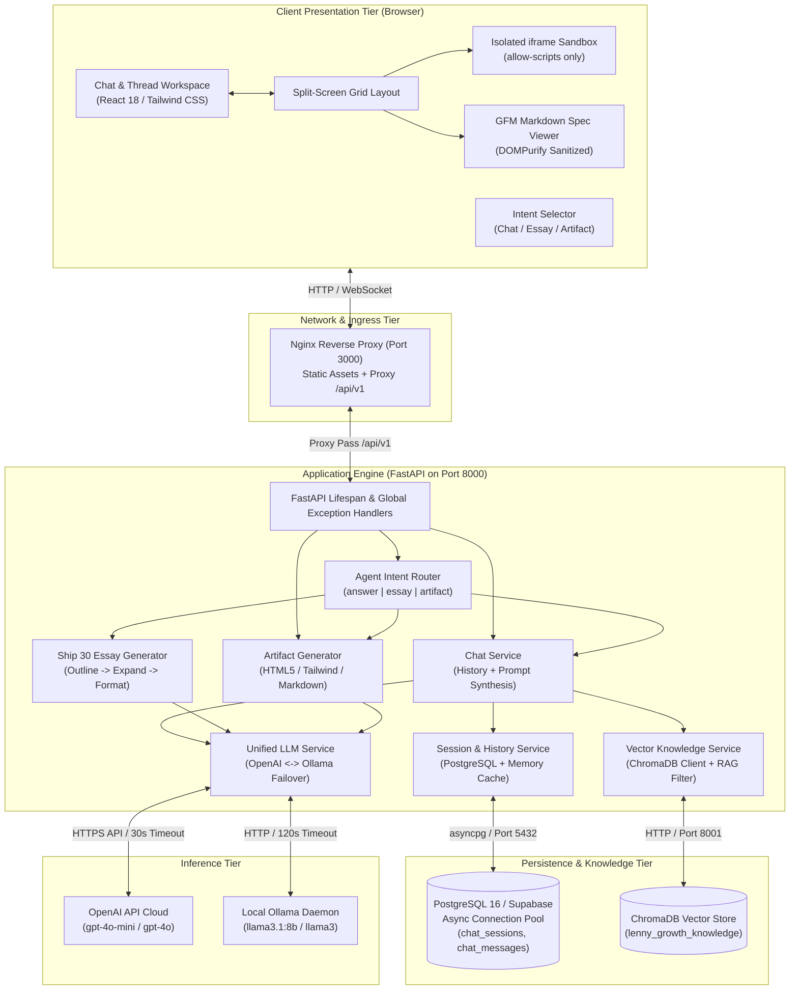
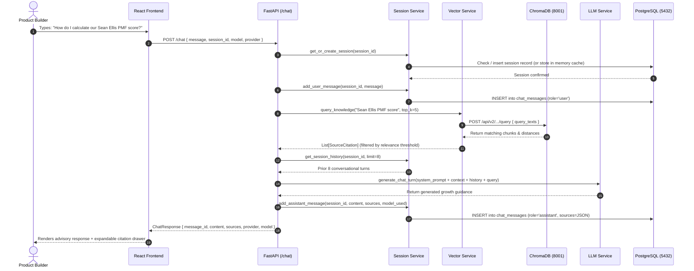
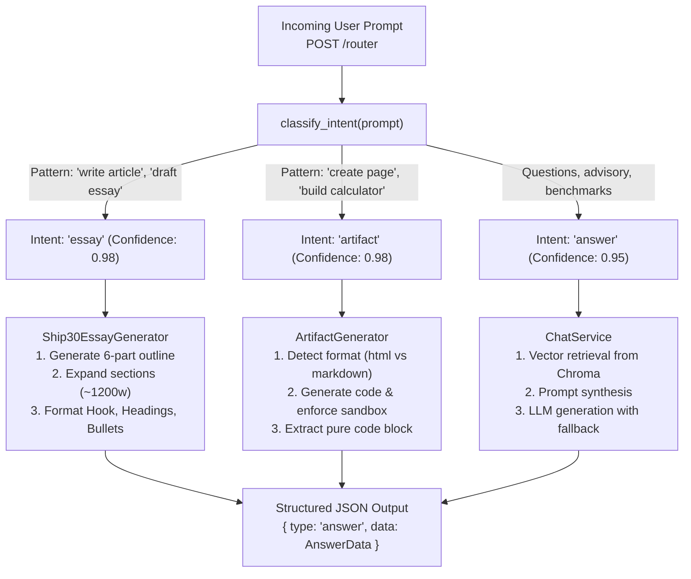
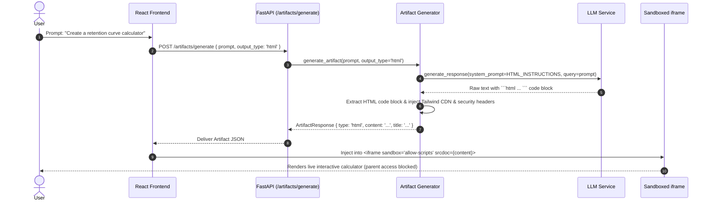
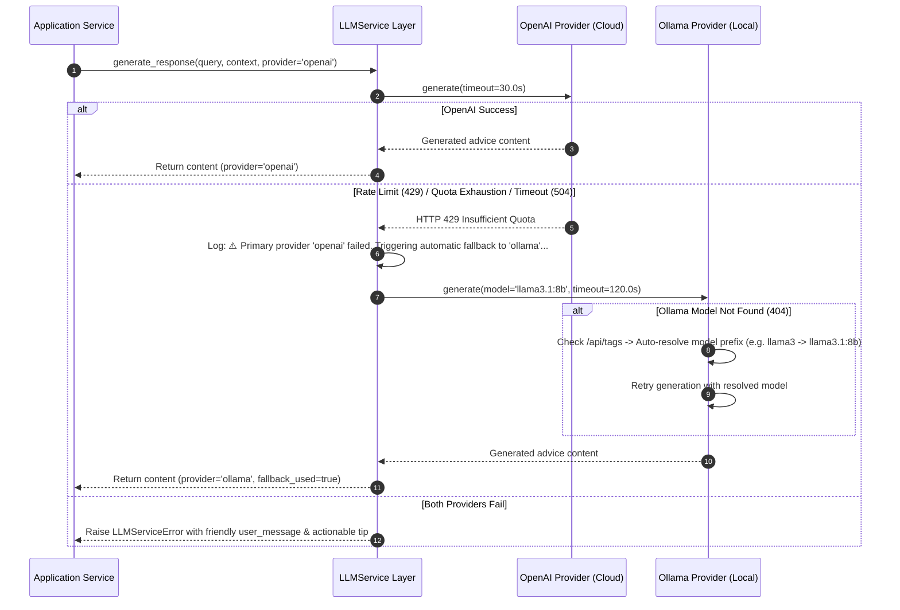
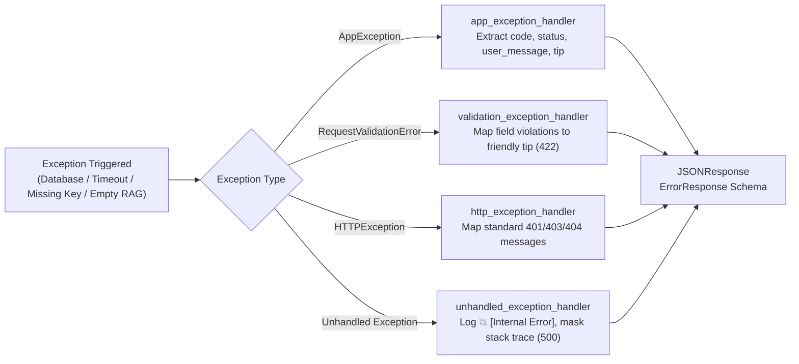
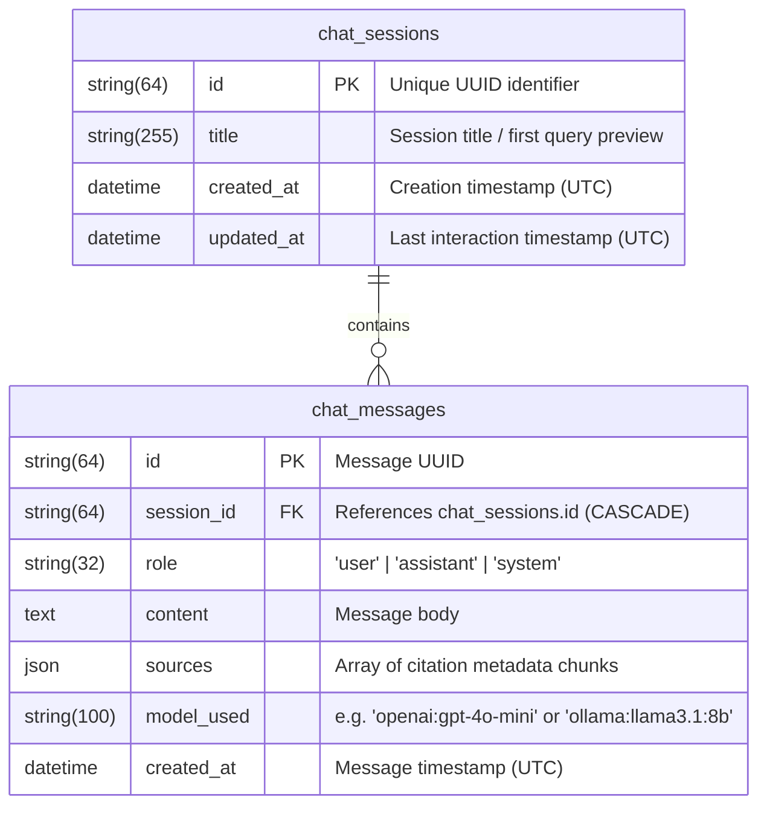
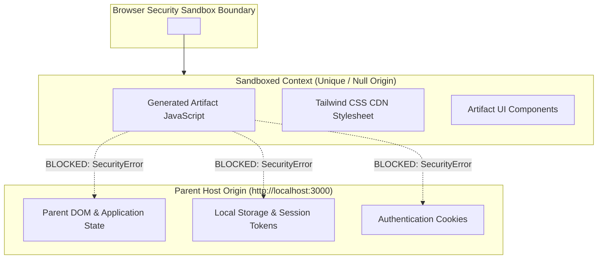

# 🏛️ System Architecture & Data Flow

This document details the architectural design, component interactions, data flows, and resilience patterns of the **Lenny Growth Assistant**.

---

## 📑 Table of Contents

- [1. Architectural Principles & Goals](#1-architectural-principles--goals)
- [2. System Design & Component Hierarchy](#2-system-design--component-hierarchy)
  - [Client Tier (React Single Page Application)](#client-tier-react-single-page-application)
  - [Gateway & Reverse Proxy (Nginx)](#gateway--reverse-proxy-nginx)
  - [Application Tier (FastAPI Asynchronous Engine)](#application-tier-fastapi-asynchronous-engine)
  - [Knowledge & Vector Tier (ChromaDB)](#knowledge--vector-tier-chromadb)
  - [Relational Persistence Tier (PostgreSQL / Supabase)](#relational-persistence-tier-postgresql--supabase)
  - [Inference Layer (Dual-Provider LLM Engine)](#inference-layer-dual-provider-llm-engine)
- [3. End-to-End Data Flows](#3-end-to-end-data-flows)
  - [Data Flow 1: Context-Grounded RAG Conversational Turn](#data-flow-1-context-grounded-rag-conversational-turn)
  - [Data Flow 2: Agent Intent Classification & Routing](#data-flow-2-agent-intent-classification--routing)
  - [Data Flow 3: Interactive Digital Artifact Generation & Sandboxed Delivery](#data-flow-3-interactive-digital-artifact-generation--sandboxed-delivery)
  - [Data Flow 4: Resilient Database Persistence & Memory Failover](#data-flow-4-resilient-database-persistence--memory-failover)
  - [Data Flow 5: Dual-Provider LLM Failover Lifecycle](#data-flow-5-dual-provider-llm-failover-lifecycle)
  - [Data Flow 6: Standardized Error Handling & Propagation](#data-flow-6-standardized-error-handling--propagation)
- [4. Database Schema & Data Models](#4-database-schema--data-models)
- [5. Vector Store & RAG Ingestion Pipeline](#5-vector-store--rag-ingestion-pipeline)
- [6. Security & Sandboxing Architecture](#6-security--sandboxing-architecture)

---

## 1. Architectural Principles & Goals

The Lenny Growth Assistant architecture is designed around four core tenets:

1. **Grounded Intelligence (RAG)**: Conversational responses and essay drafts are anchored in real product management playbooks, benchmarks, and podcast transcript excerpts, eliminating ungrounded hallucinations.
2. **Defensive Survivability**: No single component failure breaks the user experience:
   - Database outages gracefully degrade to in-memory session caches without dropping active chats.
   - LLM rate limits or quota exhaustion automatically fail over to local Ollama inference.
   - Queries with zero semantic matches smoothly fall back to foundational growth heuristics.
3. **Strict Security Isolation**: Code execution in user-facing artifacts (HTML/JavaScript tools) is quarantined in an isolated, sandboxed `<iframe>` boundary preventing access to parent DOM, local storage, cookies, and network credentials.
4. **Asynchronous Non-Blocking I/O**: The entire backend is built on asynchronous Python primitives (`asyncio`, `asyncpg`, `httpx`), delivering low latency and high concurrency under multi-user workloads.

---

## 2. System Design & Component Hierarchy



### Client Tier (React Single Page Application)
- **Framework**: React 18 with Vite, TypeScript, and Tailwind CSS.
- **State Management**: Reactive hooks (`useChat`, `useHealth`) coordinating multi-turn conversation state, session switching, and active artifact selection.
- **Artifact Workplace**: Dual-pane responsive layout rendering either conversational advice, full-width Markdown PRDs, or live HTML applications.

### Gateway & Reverse Proxy (Nginx)
- Multi-stage Docker image serving pre-compiled static frontend assets.
- Reverse proxies `/api/v1/*` requests directly to `http://backend:8000`, eliminating cross-origin complications and exposing a single unified port (`3000`).

### Application Tier (FastAPI Asynchronous Engine)
- **Lifespan Management**: Automatically initializes connection pools, performs vector database seeding, and verifies LLM provider readiness on startup.
- **Global Error Interception**: Centralized exception handlers capturing validation failures (422), domain errors (`AppException`), and unhandled exceptions (500), mapping them into predictable, user-friendly JSON payloads.

### Knowledge & Vector Tier (ChromaDB)
- Stores dense embeddings of Lenny's growth playbooks and transcript chunks.
- Performs cosine / squared L2 distance searches with semantic threshold filtering (`RAG_MIN_RELEVANCE_SCORE=0.05`).

### Relational Persistence Tier (PostgreSQL / Supabase)
- Manages long-term conversation storage (`chat_sessions`) and message sequences (`chat_messages`).
- Implements SQLAlchemy 2.0 async engine with connection pooling (`pool_size=15`, `max_overflow=10`, `pool_recycle=1800`), pre-ping validation, and exponential backoff retry.

### Inference Layer (Dual-Provider LLM Engine)
- Abstract provider factory supporting cloud (`OpenAIProvider`) and local (`OllamaProvider`).
- Enforces strict execution deadlines using `asyncio.wait_for` at both provider and service boundaries.

---

## 3. End-to-End Data Flows

### Data Flow 1: Context-Grounded RAG Conversational Turn



---

### Data Flow 2: Agent Intent Classification & Routing

The user prompt is analyzed by the `AgentRouter` to dynamically route requests to the optimal processing pipeline:



---

### Data Flow 3: Interactive Digital Artifact Generation & Sandboxed Delivery



---

### Data Flow 4: Resilient Database Persistence & Memory Failover

When cloud network disruptions or PostgreSQL restarts occur, the application activates its dual-layer resilience protocol:

```mermaid
flowchart TD
    Start["DB Operation\n(Add Message / Create Session)"] --> Retry["execute_with_db_retry()\nAttempt 1..3 with backoff + jitter"]
    
    Retry -->|Database Connected| Success["Commit to PostgreSQL\nReturn operation ID"]
    Retry -->|OperationalError / Timeout (3 attempts)| Failed["Transient DB Failure Detected"]
    
    Failed --> Log["Log: ❌ [DB Failure] Operation failed\nFalling back to in-memory store"]
    Log --> MemCache["Write to SessionService._memory_cache[session_id]\nWrite metadata to _sessions_meta_cache"]
    MemCache --> Continue["Return session_id / message_id to caller"]
    Continue --> Output["User continues conversation seamlessly\nZero 500 error interruption"]
```

---

### Data Flow 5: Dual-Provider LLM Failover Lifecycle



---

### Data Flow 6: Standardized Error Handling & Propagation

All runtime exceptions flow through centralized FastAPI error handlers:



---

## 4. Database Schema & Data Models

The relational schema is defined via SQLAlchemy 2.0 in [`backend/models/database.py`](file:///C:/Users/saive/Documents/clg/project01/backend/models/database.py):



---

## 5. Vector Store & RAG Ingestion Pipeline

ChromaDB serves as the semantic index for Lenny's product frameworks:

1. **Ingestion & Chunking**:
   - Transcripts and essays are parsed into semantic chunks using sliding windows (200-500 tokens with 50-token overlap).
   - Provenance metadata is preserved (`title`, `source`, `speaker`, `episode_title`).
2. **Dense Vector Embeddings**:
   - Chunks are vectorized using OpenAI `text-embedding-3-small` (or local `nomic-embed-text` in offline mode).
3. **Retrieval & Relevance Filtering**:
   - On incoming query, the top-k nearest neighbors are fetched via cosine/L2 distance.
   - Chunks failing the semantic threshold (`score < 0.05`) are discarded, triggering graceful fallback heuristics to avoid polluting LLM context with irrelevant noise.

---

## 6. Security & Sandboxing Architecture

To allow users to safely run generated HTML5 and JavaScript mini-tools without risking host compromise:



- **Sandbox Restrictions**: The `iframe` is strictly configured with `sandbox="allow-scripts"`.
- **Blocked Privileges**:
  - `allow-same-origin` is omitted, assigning the iframe a unique opaque origin that cannot access parent `window`, `document`, or `localStorage`.
  - `allow-top-navigation` is omitted, preventing the artifact from redirecting the parent page.
  - `allow-popups` and `allow-modals` are omitted, preventing deceptive alerts or popup phishing.
