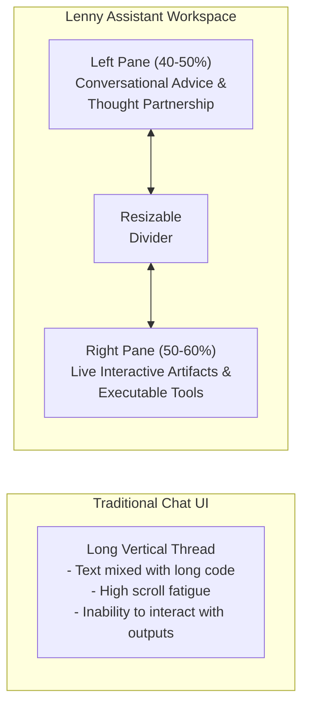
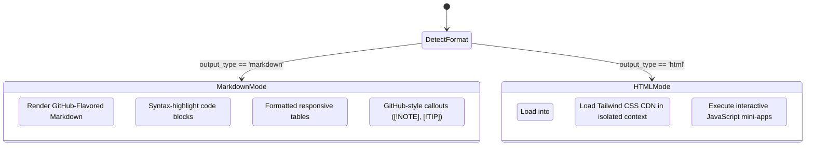

# 🎨 UI/UX Design System & Experience Decisions

This document outlines the user interface architecture, user experience design decisions, typography, color palette, security model, and interactive behaviors of the **Lenny Growth Assistant**.

---

## 📑 Table of Contents

- [1. Product Design Vision](#1-product-design-vision)
- [2. Layout Architecture & Workspace Layout](#2-layout-architecture--workspace-layout)
  - [Split-Screen Workspace Layout](#split-screen-workspace-layout)
  - [Responsive Grid & Breakpoint Behavior](#responsive-grid--breakpoint-behavior)
- [3. Design System & Visual Identity](#3-design-system--visual-identity)
  - [Color Palette](#color-palette)
  - [Typography & Hierarchy](#typography--hierarchy)
  - [Component Elevation & Shadows](#component-elevation--shadows)
- [4. Conversational Chat UX Decisions](#4-conversational-chat-ux-decisions)
  - [Message Bubble Anatomy](#message-bubble-anatomy)
  - [Citation Badges & Expandable Source Drawers](#citation-badges--expandable-source-drawers)
  - [Model & Provider Switcher](#model--provider-switcher)
  - [Loading States & Typing Indicators](#loading-states--typing-indicators)
- [5. Digital Artifact UX Decisions](#5-digital-artifact-ux-decisions)
  - [Dual-Mode Artifact Viewer (Markdown vs. HTML)](#dual-mode-artifact-viewer-markdown-vs-html)
  - [Interactive Preview vs. Raw Code View](#interactive-preview-vs-raw-code-view)
  - [Copy, Download, & Expand Actions](#copy-download--expand-actions)
- [6. Security Considerations in the UI](#6-security-considerations-in-the-ui)
  - [Sandboxed Iframe Execution Model](#sandboxed-iframe-execution-model)
  - [DOMPurify Sanitization Protocol](#dompurify-sanitization-protocol)
- [7. Error Handling UX & Empty States](#7-error-handling-ux--empty-states)
  - [Human-Centric Error Alerts](#human-centric-error-alerts)
  - [Zero-State Experience](#zero-state-experience)
- [8. Accessibility (a11y) & Usability Standards](#8-accessibility-a11y--usability-standards)

---

## 1. Product Design Vision

The Lenny Growth Assistant interface is built around a simple principle: **founders and product builders should never have to switch between conversational strategy and execution tools**. 

Traditional AI assistants force users to read code or Markdown in long, vertical chat threads, losing context as conversation continues. Our split-screen layout treats AI answers and generated artifacts (interactive calculators, growth models, and PRD specifications) as first-class, simultaneous workspaces.



---

## 2. Layout Architecture & Workspace Layout

### Split-Screen Workspace Layout

The application utilizes a multi-panel workspace:

1. **Collapsible Sidebar (Left - 260px)**:
   - Session navigation and chat thread history.
   - One-click "New Advisory Session" trigger.
   - System connectivity health indicator badge (PostgreSQL, Chroma, LLM).
2. **Chat Conversation Pane (Center / Left Pane - 40% to 50%)**:
   - Streamlined conversational feed with sticky bottom input.
   - Clean message bubbles with metadata (model tags, timestamp).
   - Expandable source citation drawers.
3. **Artifact Workspace (Right Pane - 50% to 60%)**:
   - Opens automatically when an artifact (`html` or `markdown`) is generated or requested.
   - Provides live interactive execution, tabbed code inspection, and download utilities.
   - Closes with a single click to restore full-width chat focus.

```
+-----------------------------------------------------------------------------------------+
|                                  Header Navigation Bar                                  |
| [Sidebar Toggle]  Lenny Growth Assistant      [Active Model Selector]   [System Health] |
+------------------+-----------------------------------+----------------------------------+
|                  |                                   |                                  |
|   Past Sessions  |      Chat Thread Panel            |    Sandboxed Artifact Viewer     |
|                  |                                   |                                  |
|  - PMF Bench...  |  [User]: "How do I calculate PMF?"|  [Interactive Web Preview] [Code]|
|  - Growth Loops  |                                   |  +------------------------------+|
|  - Retention     |  [Lenny]: "Sean Ellis defines..." |  |  Sean Ellis Survey Tool      ||
|                  |  Sources: [1] Sean Ellis PMF Guide|  |  [40% Metric Progress Bar]   ||
|                  |                                   |  |  Very Disappointed: [ 45% ]  ||
|                  |                                   |  |  Status: PMF Reached!        ||
|                  |                                   |  +------------------------------+|
|                  |  [ Chat Input Box               ] |  [Copy Code]  [Download HTML]    |
+------------------+-----------------------------------+----------------------------------+
```

### Responsive Grid & Breakpoint Behavior

- **Desktop (`>= 1024px`)**: True side-by-side split screen. User can consult advice while interacting with the tool simultaneously.
- **Tablet (`768px - 1023px`)**: Artifact viewer transitions into an overlay drawer with a toggle tab to slide between chat and artifact.
- **Mobile (`< 768px`)**: Stacked tab interface (`[Chat View]` / `[Artifact View]`). The sidebar collapses into a slide-over mobile drawer.

---

## 3. Design System & Visual Identity

### Color Palette

The color system is engineered using Tailwind CSS `Slate` neutrals paired with `Indigo` and `Emerald` accents:

| Token | Hex / Class | Purpose | Semantic Meaning |
| :--- | :--- | :--- | :--- |
| **Primary Brand** | `#4F46E5` (`indigo-600`) | Key buttons, active states, user message bubbles | Focus, forward momentum, clarity |
| **Primary Hover** | `#4338CA` (`indigo-700`) | Hover state for primary buttons | Interactive responsiveness |
| **Accent Success** | `#10B981` (`emerald-500`) | Health online indicators, PMF positive benchmarks | Stability, high retention, healthy loops |
| **Accent Warning** | `#F59E0B` (`amber-500`) | Transient retry notices, degraded health states | Caution, non-blocking attention |
| **Accent Danger** | `#EF4444` (`red-500`) | Error alerts, connection drops | Immediate actionable alert |
| **Surface Dark** | `#0F172A` (`slate-900`) | Main application background | High contrast, visual depth |
| **Surface Card** | `#1E293B` (`slate-800`) | Message cards, sidebar, modal backgrounds | Card elevation, optical layering |
| **Border Neutral** | `#334155` (`slate-700`) | Card dividers, input borders | Subtle structural boundaries |
| **Text Primary** | `#F8FAFC` (`slate-50`) | Primary headlines and message text | Maximum legibility |
| **Text Secondary** | `#94A3B8` (`slate-400`) | Timestamps, citations, secondary labels | Reduced visual clutter |

### Typography & Hierarchy

- **Font Family**: Inter, `-apple-system`, BlinkMacSystemFont, "Segoe UI", Roboto, sans-serif.
- **Code Font**: JetBrains Mono, Fira Code, Menlo, monospace.
- **Hierarchy Scale**:
  - `Display / H1`: 24px (`text-2xl`), font-bold, tracking-tight.
  - `Section / H2`: 18px (`text-lg`), font-semibold.
  - `Card / H3`: 15px (`text-base`), font-medium.
  - `Body Text`: 14px (`text-sm`), leading-relaxed (1.625 line height for comfortable long-form reading).
  - `Metadata / Badges`: 12px (`text-xs`), font-medium, uppercase tracking-wider.

### Component Elevation & Shadows

- `shadow-sm`: Used on subtle inputs and inactive buttons (`0 1px 2px rgba(0,0,0,0.05)`).
- `shadow-md`: Used on active message bubbles and dropdown menus (`0 4px 6px -1px rgba(0,0,0,0.1)`).
- `shadow-xl`: Used on floating artifact viewer pane and active modal dialogs.

---

## 4. Conversational Chat UX Decisions

### Message Bubble Anatomy

```
+-------------------------------------------------------------------+
|  [Avatar] Lenny Growth Assistant               openai:gpt-4o-mini |
|                                                      10:42 AM     |
|  Product-Market Fit is not a binary milestone; it is a gradient   |
|  and a phase change.                                              |
|                                                                   |
|  Key Signals to Validate:                                         |
|  - Flattening cohort retention curves parallel to x-axis          |
|  - >40% "Very Disappointed" Sean Ellis benchmark                  |
|                                                                   |
|  +-------------------------------------------------------------+  |
|  | [BookOpen] Grounded in 2 Lenny Knowledge Sources       [v]  |  |
|  +-------------------------------------------------------------+  |
+-------------------------------------------------------------------+
```

- **Visual Differentiation**: User messages are right-aligned with `bg-indigo-600 text-white`; assistant messages are left-aligned with `bg-slate-800 text-slate-100 border border-slate-700`.
- **Model Attribution Tag**: Every assistant turn displays the exact model used (e.g. `openai:gpt-4o-mini` or `ollama:llama3.1:8b`). If failover occurred, a subtle `(Fallback)` badge is appended.

### Citation Badges & Expandable Source Drawers

- Rather than littering response text with inline numeric references that break reading flow, citations are aggregated in an interactive footer card.
- Clicking the citation bar expands an accordion showing:
  - Source Title (e.g. *"Lenny's Newsletter: The PMF Guide"*).
  - Exact textual excerpt used for context.
  - Semantic relevance percentage badge (`94% match`).

### Model & Provider Switcher

The header features an intuitive dropdown selector:
- **Cloud (OpenAI)**: `gpt-4o-mini` (Fast & cost-efficient) or `gpt-4o` (Deep reasoning).
- **Local (Ollama)**: `llama3.1:8b` (Zero API cost, 100% private offline).
- The switcher indicates live availability: if Ollama is unreachable, a subtle tooltip suggests running `ollama serve`.

### Loading States & Typing Indicators

- When generation begins, an animated pulse dot indicator appears (`animate-pulse`).
- If vector retrieval takes >500ms, the status updates to *"Searching Lenny's playbooks..."* before transitioning to *"Synthesizing recommendations..."*.

---

## 5. Digital Artifact UX Decisions

### Dual-Mode Artifact Viewer (Markdown vs. HTML)

The artifact workspace automatically adapts to the artifact format:



### Interactive Preview vs. Raw Code View

The viewer header provides toggle tabs:
- **`[Preview]`**: Executes the interactive HTML tool or renders formatted Markdown.
- **`[Code]`**: Displays formatted syntax-highlighted source code with line numbers and one-click copy.

### Copy, Download, & Expand Actions

- **Copy**: One-click clipboard copy with a checkmark feedback animation (`Copied!`).
- **Download**: Exports self-contained `.html` or `.md` files directly to the user's filesystem.
- **Full-Screen**: Expands the artifact viewer to 100% viewport width for deep focus work.

---

## 6. Security Considerations in the UI

### Sandboxed Iframe Execution Model

When rendering user-generated or AI-generated HTML tools, the interface employs strict defense-in-depth isolation:

```html
<iframe
  srcdoc="{sanitizedHtmlContent}"
  sandbox="allow-scripts"
  referrerpolicy="no-referrer"
  loading="lazy"
  class="w-full h-full border-0 bg-white"
/>
```

| Security Flag | Status | Rationale |
| :--- | :--- | :--- |
| `allow-scripts` | **ENABLED** | Essential for interactive tools (calculators, sliders, charts, forms). |
| `allow-same-origin` | **DISABLED** | Assigns the iframe an opaque `null` origin. Prevents access to parent `localStorage`, cookies, and session data. |
| `allow-top-navigation` | **DISABLED** | Prevents generated code from hijacking or redirecting the main application page. |
| `allow-popups` | **DISABLED** | Blocks intrusive popups or window opening. |
| `allow-forms` | **DISABLED** | Prevents submission of external credential-harvesting forms. |

### DOMPurify Sanitization Protocol

Before injecting Markdown or HTML into the DOM, content passes through DOMPurify:
- Strips dangerous attributes: `onerror`, `onload`, `javascript:`, `data:` URIs.
- Strips unsafe elements: `<script>`, `<object>`, `<embed>`, `<applet>`.
- Allows clean semantic tags: `<h1>`–`<h6>`, `<p>`, `<ul>`, `<li>`, `<table>`, `<code>`, `<pre>`.

---

## 7. Error Handling UX & Empty States

### Human-Centric Error Alerts

Errors are transformed into helpful coaching opportunities rather than scary stack traces:

```
+-------------------------------------------------------------------+
|  [AlertCircle] AI Provider Limit Reached                          |
|                                                                   |
|  Your OpenAI credit balance has been exhausted.                   |
|                                                                   |
|  👉 What you can do:                                              |
|  Switch the model selector in the top bar to 'Ollama' to enjoy    |
|  free, unlimited local inference on your machine.                 |
|                                                                   |
|  [ Switch to Ollama ]                         [ Dismiss ]         |
+-------------------------------------------------------------------+
```

### Zero-State Experience

When opening a brand new advisory session, the empty canvas displays high-value prompt starters:
- *"How do I measure whether my product has reached Product-Market Fit?"*
- *"Help me identify the single North Star Metric for an enterprise B2B SaaS product."*
- *"Create an interactive retention curve calculator in HTML/Tailwind."*
- *"Draft a Ship 30 article on the four compounding growth loops."*

---

## 8. Accessibility (a11y) & Usability Standards

- **Keyboard Navigation**: Full keyboard accessibility (`Tab`, `Shift+Tab`, `Enter` to submit, `Shift+Enter` for multiline text input, `Esc` to close modals).
- **Contrast Ratios**: All text meets WCAG 2.1 AA standards (minimum 4.5:1 contrast ratio against card backgrounds).
- **Screen Reader Friendly**: ARIA labels on all icon buttons (`aria-label="New Session"`, `aria-label="Toggle Artifact Code View"`).
- **Reduced Motion**: Respects `prefers-reduced-motion` media queries by disabling non-essential transitions.
