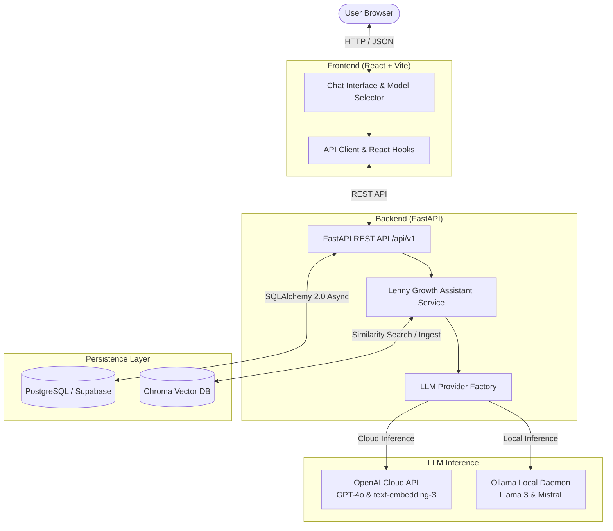
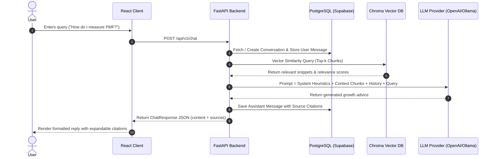

# 🏛️ Lenny Growth Assistant Architecture

This document describes the high-level architecture, component interaction, and RAG data flow of the **Lenny Growth Assistant**.

---

## 1. High-Level System Architecture

---

## 2. RAG (Retrieval-Augmented Generation) Workflow

When a user submits a question through the chat interface:

---

## 3. Core Component Overview

### A. FastAPI Backend (`backend/app/`)
- **Async First**: Built on Python 3.10+ async/await primitives with `uvicorn` and `asyncpg`.
- **Modular Layering**:
  - `core/`: Settings (Pydantic v2), database connection pools, structured logging.
  - `db/`: Declarative ORM models (`User`, `Conversation`, `Message`).
  - `schemas/`: Request and response validation contracts.
  - `services/`: Business logic, vector index management, and LLM abstraction.
  - `api/v1/`: Versioned API endpoints with dependency injection.

### B. Relational Storage (`PostgreSQL` / `Supabase`)
- Stores user identities, conversations, and granular message histories.
- Compatible with hosted Supabase instances using standard connection pooling or direct connection.

### C. Vector Store (`ChromaDB`)
- Stores embedded text chunks from Lenny's growth essays, frameworks, and playbooks.
- Default collection `lenny_growth_knowledge` automatically bootstrapped with seed heuristics on startup.
- Supports both standalone Chroma HTTP server and local persistent directory modes.

### D. LLM Abstraction Layer
- `BaseLLMService` defines a common interface for `generate_response()`, `get_embeddings()`, and `health_check()`.
- `OpenAIService`: Leverages OpenAI's asynchronous Python SDK for cutting-edge cloud models (`gpt-4o`).
- `OllamaService`: Directly interfaces with local Ollama daemons for private, offline inference (`llama3`).
- `get_llm_service()`: Resolves the target provider dynamically per request or via global environment variables.

### E. Frontend (`React` + `Vite`)
- Built with TypeScript and TailwindCSS.
- Real-time backend health monitoring (PostgreSQL & Chroma statuses).
- Interactive model selector allowing users to toggle between OpenAI and Ollama.
- Expandable citation previews displaying retrieved chunks and semantic similarity scores.
