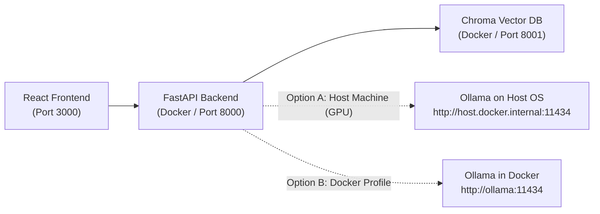

# Ollama Local LLM Integration Guide

This guide explains how to configure and run the **Lenny Growth Assistant** using local, private LLM inference powered by **Ollama**.

---

## 1. Architecture Overview

The Lenny Growth Assistant supports dynamic switching between **OpenAI** (cloud inference) and **Ollama** (local inference) using a unified provider abstraction.



---

## 2. Option A: Running Ollama on Host Machine (Recommended for GPU)

Running Ollama natively on your host machine allows the model to utilize hardware acceleration (Apple Metal on macOS, NVIDIA CUDA on Windows/Linux).

### Step 1: Install Ollama
- **macOS / Windows**: Download the installer from [ollama.com](https://ollama.com).
- **Linux**:
  ```bash
  curl -fsSL https://ollama.com/install.sh | sh
  ```

### Step 2: Pull Required Models
The assistant requires a text generation model and an embedding model:
```bash
# 1. Pull the chat & reasoning model
ollama pull llama3

# 2. Pull the embedding model (used for vector chunk similarity)
ollama pull nomic-embed-text
```

### Step 3: Configure Network Binding
By default, Ollama binds to `127.0.0.1:11434`. To allow Docker containers to communicate with it:

- **macOS & Windows**: Docker Desktop automatically forwards `host.docker.internal` to the host network. No extra flags needed.
- **Linux**: Ensure Ollama listens on all network interfaces:
  ```bash
  # In systemd service or before running ollama serve:
  export OLLAMA_HOST=0.0.0.0:11434
  ollama serve
  ```

### Step 4: Configure `.env`
In the root directory, update `.env`:
```ini
# Switch active provider
LLM_PROVIDER=ollama

# When backend runs inside Docker, reference host.docker.internal:
OLLAMA_BASE_URL=http://host.docker.internal:11434
OLLAMA_MODEL=llama3
OLLAMA_EMBEDDING_MODEL=nomic-embed-text
```

---

## 3. Option B: Running Ollama Inside Docker (Containerized)

If you prefer a 100% containerized environment without installing Ollama locally, you can use the built-in Docker Compose profile:

```bash
docker compose --profile ollama up -d
```

### Pull models into the container:
```bash
docker exec -it lenny-ollama ollama pull llama3
docker exec -it lenny-ollama ollama pull nomic-embed-text
```

### Update `.env` for container-to-container networking:
```ini
LLM_PROVIDER=ollama
OLLAMA_BASE_URL=http://ollama:11434
OLLAMA_MODEL=llama3
OLLAMA_EMBEDDING_MODEL=nomic-embed-text
```

---

## 4. Verification & Testing

### 1. Test Ollama API Directly
From your terminal:
```bash
curl http://localhost:11434/api/tags
```
Expected output includes `llama3:latest` and `nomic-embed-text:latest`.

### 2. Verify Assistant Health Check
Check that the FastAPI backend recognizes the Ollama service:
```bash
curl http://localhost:8000/health
```
Response:
```json
{
  "status": "healthy",
  "environment": "development",
  "database": { "status": "healthy" },
  "vector_store": { "status": "healthy" },
  "llm": {
    "status": "healthy",
    "details": {
      "provider": "ollama",
      "model": "llama3",
      "base_url": "http://host.docker.internal:11434"
    }
  }
}
```

### 3. Send a Test Chat Message with Ollama
```bash
curl -X POST http://localhost:8000/chat \
  -H "Content-Type: application/json" \
  -d '{
    "message": "What is the 40% PMF benchmark?",
    "provider": "ollama",
    "model": "llama3"
  }'
```

---

## 5. Troubleshooting & FAQ

| Problem | Root Cause | Solution |
| :--- | :--- | :--- |
| `Failed to connect to host.docker.internal` | Container cannot reach host OS | Verify `extra_hosts: ["host.docker.internal:host-gateway"]` is in `docker-compose.yml`. On Linux, ensure `OLLAMA_HOST=0.0.0.0`. |
| `Model llama3 not found` | Model was not downloaded | Run `ollama pull llama3` on the host machine. |
| Slow generation on local laptop | Model running on CPU only | Use a lighter model like `phi3:mini` or `llama3.2:1b`, or allocate more CPU/RAM in Docker Desktop settings. |
| Ingestion vector dimension mismatch | Different embedding models used | If switching between OpenAI and Ollama embeddings, clear `chroma_data` or use a separate collection name (`CHROMA_COLLECTION_NAME=lenny_ollama_knowledge`). |
